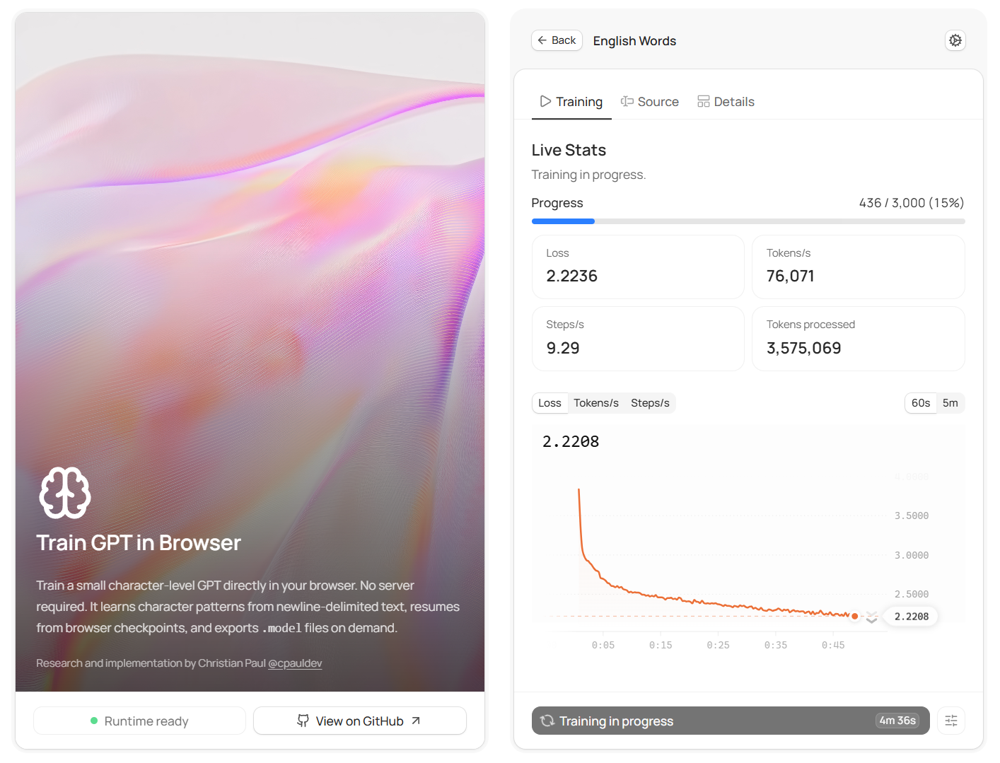

# Train GPT in Browser

Train a small character-level GPT directly in your browser on newline-delimited text and generate strings that follow the character patterns, structure, and common sequences learned from that dataset. Use one of the built-in datasets or upload your own `.txt` file, edit it locally, resume from browser checkpoints, and export a DreamPhraseGPT-compatible `.model` file.

### [Live demo](https://cpauldev.github.io/train-gpt-in-browser/)

> Note: The demo may not run reliably on some phones and tablets. The app falls back to CPU when WebGPU is unavailable, but mobile browser support, available memory, and compute performance vary widely.

Example outputs trained on English words include `glossoscope`, `heartways`, `bulletine`, `joulemaker`, `braqueousness`, `chlorosiphon`, `langeling`, `margariums`, `outtravelers`, and `zamoralize`.

Example outputs trained on U.S. baby names include `Miryella`, `Beliana`, `Camiliah`, `Cheraine`, `Leeandro`, `Eivyn`, `Franceline`, `Jadiza`, `Dejanell`, and `Zalinda`.

*Training runs in a dedicated Web Worker with TensorFlow.js, using WebGPU when available and CPU otherwise, and everything stays local in browser storage. [`DreamPhraseGPT`](https://github.com/cpauldev/dreamphrase-gpt) is the Python/PyTorch counterpart; it adds CUDA, Apple Silicon / MPS, optional `torch.compile`, ONNX export, and a CLI artifact manager, while this app keeps the same high-level character-level model family, bundled example datasets, and `.model` export format in a browser-native runtime.*

## Quick start

With Bun:

```bash
bun install
bun run dev
```

With npm:

```bash
npm install
npm run dev
```

Open `http://localhost:5173`, choose a built-in dataset or upload a plain-text `.txt` file, then start training from the **Training** tab.

## Storage and exports

- Built-in datasets are copied into browser storage on first load so they can be edited locally without touching the checked-in files.
- Workspace files, run metadata, logs, likes, telemetry, active selections, and checkpoints are stored in IndexedDB.
- `.model` downloads are generated on demand from the latest checkpoint, then cached in the browser's private file storage (OPFS) when supported and in IndexedDB otherwise.
- Resetting local data clears saved files, runs, checkpoints, cached exports, and UI preferences, then restores the bundled datasets.

## Datasets

The repository ships with two built-in datasets in [`public/datasets`](public/datasets):

| Dataset | File | Lines |
| --- | --- | ---: |
| English Words | `english_words.txt` | 370,105 |
| U.S. Baby Names | `us_baby_names.txt` | 104,819 |

Dataset rules are defined by the trainer itself:

- Input must be plain text (`.txt` or `text/plain`).
- Each non-empty line is one training sample.
- Leading and trailing whitespace is trimmed from every line.
- Blank lines are ignored.

## Training controls

The browser UI exposes these run settings:

- Backend: `auto`, `webgpu`, or `cpu`
- Seed
- Steps
- Batch size
- Block size
- Layer count
- Embedding width
- Attention head count
- Learning rate
- Weight decay
- Samples to generate after training
- Default generation temperature

The app keeps the latest run for each dataset file. Starting a fresh run for the same file replaces the previous saved run for that file; resuming continues from the latest checkpoint instead.

## Architecture and training

The model is a decoder-only, character-level GPT. In this browser implementation it uses:

- Causal self-attention in the style of [Attention Is All You Need](https://arxiv.org/abs/1706.03762)
- Learned token embeddings and learned positional embeddings
- [RMSNorm](https://arxiv.org/abs/1910.07467)
- [SwiGLU](https://arxiv.org/abs/2002.05202) feed-forward layers
- Residual connections around both the attention and feed-forward sublayers
- Manual [AdamW](https://arxiv.org/abs/1711.05101)-style updates with linear learning-rate decay over the configured training horizon
- Exact-match source filtering with a Bloom filter embedded in checkpoints and exports
- DreamPhraseGPT-compatible `.model` export that packages an ONNX graph, tokenizer metadata, and source-filter metadata

The default browser settings use a small 4-layer, 4-head, 128-dimensional model with 32-token context.

On a new run, the app trims and filters the dataset, shuffles the documents, builds a character vocabulary, and converts the data into a single training stream. Training samples random contiguous windows from that stream, uses next-token cross-entropy, runs for a fixed number of sampled steps, and linearly decays the learning rate toward zero. There is no validation split, epoch-based loop, or warmup schedule.

Training runs in `src/workers/trainer-worker.ts` Web Worker so the React UI stays responsive while the TensorFlow.js runtime handles the forward pass, backpropagation, checkpointing, and sample generation. The runtime prefers `webgpu` and falls back to `cpu` if needed. Checkpoints include the model, optimizer, tokenizer, dataset state, RNG state, and resume metadata, with autosaves during training and again at completion.

Generation is autoregressive at the character level. The worker retries outputs that match source lines via a Bloom filter, which can occasionally reject a novel string because Bloom filters have false positives. Exported `.model` files use the DreamPhraseGPT ONNX bundle format. Compared with [`DreamPhraseGPT`](https://github.com/cpauldev/dreamphrase-gpt), this project keeps the same high-level model family and `.model` export format, but uses a browser-native TensorFlow.js runtime instead of the Python project's accelerator stack such as CUDA, MPS, AMP, or `torch.compile`.

## Offline Behavior

The app registers a service worker, precaches a minimal app shell plus the bundled datasets, and then warms the cache with the assets fetched during a successful session. After the first successful load, an offline refresh should reopen the app shell instead of showing the browser's default network error, and the built-in datasets remain available from local browser storage.

## Dev

Use Bun or npm with the same scripts:

```bash
bun run typecheck
bun run check
bun run test:run
bun run build
```

Replace `bun run` with `npm run` if you prefer npm.

If you want Vitest in watch mode instead of a single run:

```bash
bun run test
```

## License

MIT. See [`LICENSE`](LICENSE).
