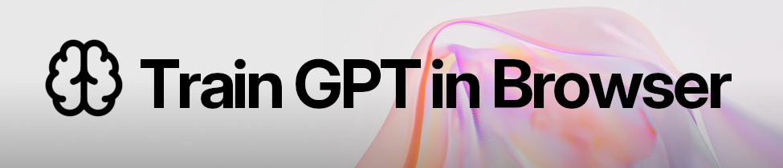

# Train GPT in Browser

Train a character-level transformer directly in your browser. Upload any newline-delimited text file, configure the model and training settings, and generate novel strings that follow the learned character patterns — no server, no Python, no install required. Export to `.model` file for [`DreamPhraseGPT`](https://github.com/cpauldev/dreamphrase-gpt) compatibility.

[Live demo](https://cpauldev.github.io/train-gpt-in-browser/)

Example outputs trained on English words include `glossoscope`, `heartways`, `bulletine`, `joulemaker`, `braqueousness`, `chlorosiphon`, `langeling`, `margariums`, `outtravelers`, and `zamoralize`.

Example outputs trained on U.S. baby names include `Miryella`, `Beliana`, `Camiliah`, `Cheraine`, `Leeandro`, `Eivyn`, `Franceline`, `Jadiza`, `Dejanell`, and `Zalinda`.

*Training runs in a Web Worker using TensorFlow.js with WebGPU (where supported) or CPU fallback. Runs are saved and resumable via IndexedDB and OPFS.*

---

<!-- demo video or screenshot -->

---

## Quick start

```bash
bun install
bun run dev
```

Open `http://localhost:5173`, pick a built-in dataset or upload your own `.txt` file, and click **Train**.

## Datasets

Two datasets are included:

| Dataset | Description |
| --- | --- |
| English Words | ~370,000 newline-delimited English words |
| U.S. Baby Names | ~105,000 newline-delimited U.S. baby names |

To use your own dataset, upload any newline-delimited `.txt` file — one sample per line.

## Architecture

The model is a decoder-only, character-level GPT implemented in TensorFlow.js. It uses:

- Causal self-attention
- [RMSNorm](https://arxiv.org/abs/1910.07467)
- [SwiGLU](https://arxiv.org/abs/2002.05202) feed-forward layers
- AdamW with linear learning-rate decay
- Built-in Bloom filter that rejects exact source-line matches at generation time

Training runs in a dedicated Web Worker to keep the UI responsive. WebGPU is used automatically where available; CPU is the fallback.

## Python version

[DreamPhraseGPT](https://github.com/cpauldev/dreamphrase-gpt) is the Python/PyTorch counterpart. It supports CUDA, Apple Silicon / MPS, optional `torch.compile`, ONNX export, and a CLI artifact manager. The core architecture and datasets are shared between both.

## Dev

```bash
bun run typecheck   # TypeScript
bun run check       # Biome lint + format
bun run check:write # Biome lint + format, auto-fix
bun run test        # Vitest
```
